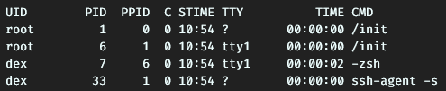

# sisop-modul-2

# Daemon dan Proses

Menggunakan:
* Linux
* Bahasa C (compile dengan _gcc_)

# Daftar Isi

* Daemon dan Proses
    * [Daftar Isi](#daftar-isi)
    * [Proses](#proses)
        * [1. Pengertian](#1-pengertian)
        * [2. Macam-Macam PID](#2-macam-macam-pid)
            * [2.1 User ID (UID)](#21-user-id-(uid))
            * [2.2 Process ID (PID)](#22-process-id-(pid))
            * [2.3 Parent PID (PPID)](#23-parent-pid-(ppid))

# Proses

## 1. Pengertian
Proses adalah kondisi dimana OS menjalankan (eksekusi) suatu program. Ketika suatu program tersebut dieksekusi oleh OS, proses tersebut memiliki PID (Process ID) yang merupakan identifier dari suatu proses. Pada UNIX, untuk melihat proses yang dieksekusi oleh OS dengan memanggil perintah shell ```ps```. Untuk melihat lebih lanjut mengenai perintah ```ps``` dapat membuka ```man ps```.

Dalam penggunaannya, suatu proses dapat membentuk proses lainnya yang disebut _spawning process_. Proses yang memanggil proses lainnya disebut _parent process_ dan yang terpanggil disebut _child process_.

## 2. Macam-Macam PID

### 2.1 User ID (UID)
Merupakan identifier dari suatu proses yang menampilkan user yang menjalankan suatu program. Pada program C, dapat memanggil fungsi ``` uid_t getuid(void);```

### 2.2 Process ID (PID)
Angka unik dari suatu proses yang sedang berjalan untuk mengidentifikasi suatu proses. Pada program C, dapat memanggil fungsi ```pid_t getpid(void);```

### 2.3 Parent PID (PPID)
Setiap proses memiliki identifier tersendiri dan juga setelah proses tersebut membuat proses lainnya. Proses yang terbentuk ini memiliki identifier berupa ID dari pembuatnya (parent). Pada program C, dapat memanggil fungsi ```
pid_t getppid(void);```.

## 3. Melihat Proses Berjalan
Untuk melihat proces yang sedang berjalan di OS, dapat menggunakan ```ps -ef``` untuk melihat secara detailnya.



Penjelasan:
  * **UID**: user yang menjalankan program
  * **PID**: process IDnya
  * **PPID**: parent PID, kalau tidak ada parent akan bernilai 0
  * **C**: CPU Util. (%)
  * **STIME**: waktu proses dijalankan
  * **TTY**: terminal yang menjalankan proses. Jika tidak ada berarti background
  * **TIME**: lamanya proses berjalan
  * **CMD**: perintah yang menjalankan proses tersebut

## 4. Menghentikan Proses
Untuk menghentikan (_terminate_) proses yang berjalan, jalankan perintah shell ```kill [options] <pid>```. Biasanya untuk menghentikan paksa suatu proses dapat menggunakan perintah ```kill -9 <pid>```. 

### Macam-Macam Signal

| Signal name | Signal value  | Effect       |
| ------------|:-------------:| -------------|
| SIGHUP      | 1             | Hangup         |
| SIGINT      | 2             | Interrupt from keyboard  |
| SIGKILL     | 9             | Kill signal   |
| SIGTERM     | 15            | Termination signal
| SIGSTOP     | 17,19,23      | Stop the process

Secara default ketika menggunakan perintah shell ```kill <pid>```, akan menggunakan ```SIGSTOP``` yang mana akan menghentikan proses namun masih dapat dilanjutkan kembali.

## 5. Membuat Proses

### **fork**
```fork``` adalah fungsi _system call_ di C untuk melakukan _spawning process_. Setelah memanggil fungsi itu, akan terdapat proses baru yang merupakan _child process_ dan mengembalikan nilai 0 untuk _child process_ dan nilai _PID_ untuk _parent process_. 
